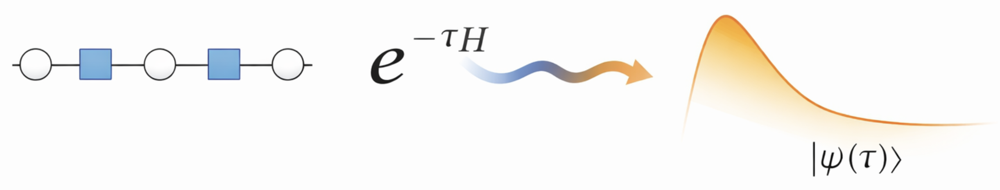

# Matrix Product State (MPS) SWAP Network QUBO Solver

<p align="center">
  
</p>

This repository contains the code used to produce the results of the paper *SWAP-Network Routing and Spectral Qubit Ordering for MPS Imaginary-Time Optimization*, available as a [pre-print on arXiv](https://arxiv.org/abs/2511.02980).

## Project Description
The solver implements tensor-network-based imaginary time evolution to optimize QUBO instances using matrix product states. Rectangular and triangular SWAP network layouts are combined with problem-aware qubit orderings to improve convergence on dense graphs. The accompanying utilities cover data loading, sampling, entanglement analysis, and data analysis.

## Repository Layout
- `src/`: MPS-TEBD solver and utilities.
- `instances/`: problem instances used for benchmarking.
  - MaxCut: 10 instances (`graph0..graph9`) per graph family.
  - Portfolio: reduced subset (`market_data/po_a010_t10_orig` and the associated Ising/QUBO JSON files).
- `results/`: simulation outputs.
- `benchmark/`: benchmark outputs by Gurobi and BiqCrunch.
  - `benchmark/gurobi_results/...`
  - `benchmark/biqcrunch_results/...`
- `figures/`: figure-generation notebooks/scripts.
- `generate_instances/`: scripts used to generate QUBO/Ising instances.

## Requirements
The code is written in Julia and was tested with Julia version 1.8.1. Tensor networks simulations were performed using the ITensors.jl 0.6.19 and ITensorMPS 0.2.5 packages.

## Data Availability
- The `results/` directory is distributed via Zenodo (due to repository size limits).
- Public dataset DOI (Zenodo): **TBD** (to be added).
- After downloading from Zenodo, place/unpack the archive so that `results/` is at repository root.

## Reproducing Results
- Install the Julia version specified above and clone this repository.
- Activate the project and instantiate dependencies: `julia --project=. -e 'using Pkg; Pkg.instantiate()'`.
- Use one of two paths:
  1. Clone this repository and download `results/` from Zenodo and generate plots directly.
  2. Re-run simulations/benchmarks locally.

### Simulation Parameters
The defaults in `src/main.jl` are aligned with the released MaxCut sweep:
- `chi_values = [8, 16, 32, 64, 128]`
- `cutoff = 1e-9`
- `Nsamples = 1000`
- `Nsteps = 30`
- `qubit_orderings = ["shuffle", "fiedler"]` (SK + `fiedler` is skipped by design)
- `network_architectures = ["triangular", "quadratic"]`
- `instance_indices = 0:9`
- `directory_name = "MPS_final"` (default output folder for MaxCut results)
- Graph-dependent `tau` values in `instance_config`:
  - ER: `3/50`
  - SK: `3/100`
  - 3Reg: `1.0`

Portfolio entry in `main.jl` points to:
- `instances/portfolio/Ising/ising_Ns10_Nt9_Nq2_K10_gamma1_zeta0.042_rho1.0.json`

For the portfolio results, files are stored under `results/portfolio/MPS_dtau10/...`.

### Benchmarks
- Gurobi benchmark script: `benchmark/gurobi_benchmark.py`
- BiqCrunch benchmark script: `benchmark/BiqCrunch_benchmark.py`

## Contact
For any questions or issues, please contact the corresponding author.

## Citation
If you build upon this code in academic or industrial work, please cite the pre-print as follows:

```bibtex
@misc{åsgrim2025swapnetworkroutingspectralqubit,
      title={SWAP-Network Routing and Spectral Qubit Ordering for MPS Imaginary-Time Optimization}, 
      author={Erik M. Åsgrim and Stefano Markidis},
      year={2025},
      eprint={2511.02980},
      archivePrefix={arXiv},
      primaryClass={quant-ph},
      url={https://arxiv.org/abs/2511.02980}, 
}
```

Feel free to adapt the entry to match the published venue details.
